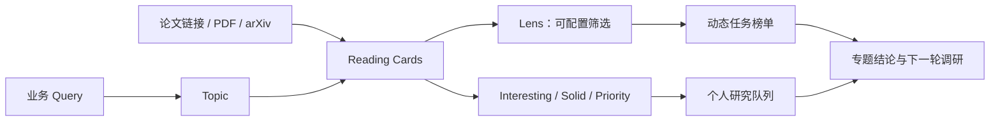

# Evidence-Backed Research Workspace

一个开源的中文研究工作台：把业务问题、论文证据、可配置筛选视角和个人研究判断分开维护，并用 Quartz 发布为可搜索、可双链的静态知识库。

在线示例：[实习调研](https://jimi-ha.github.io/internship-research/)



## 它解决什么问题？

一篇论文在不同业务目标下可能有不同价值。因此本项目不把“论文摘要、任务筛选、个人品味”压缩成一个总分：

- **Paper / Reading Card**：论文的 Motivation、Method、Results、Ablation、Sensitivity 与 Limitations；
- **Topic**：一个可持续扩充的业务研究问题；
- **Lens**：当前任务下的筛选条件、权重与可解释排序；
- **Editorial Evaluation**：独立的 Interesting、Solid 和人工优先级。

例如，在 Reward Resemble 专题里，你可以分别建立“梯度冲突优先”“量纲处理优先”“低工程侵入”“安全约束优先”等 Lens。它们生成不同榜单；任何榜单都不是论文的客观总排名。

## 快速开始

要求：Node.js 22+、npm 10+。

```bash
npm ci
npm run dev
```

构建、内容校验和格式检查：

```bash
npm run validate:content
npm run check:workspace
npm run build
```

站点内容位于 `content/`。本地开发服务默认由 Quartz 启动。

## 从一个业务问题开始

输入一个 Query，例如：

> 如何让多个 Reward 信号更可比较、更可聚合，并避免尺度、梯度和优化速度差异导致目标支配？

建议流程：

1. 让 AI 先给出问题重述、候选机制、检索词、候选论文与证据空白；
2. 或者直接导入自己已收集的论文链接；
3. 为每篇论文建立 Reading Card；
4. 在 Topic 中标注“它对当前问题具体解决 / 未解决什么”；
5. 由 AI 提议、人工确认机制维度；
6. 创建多个 Lens，而不是强行维护唯一总榜；
7. 独立记录 Interesting、Solid、个人优先级与下一步动作；
8. 用当前结论和空白驱动下一轮检索、深读或复现。

完整模型见：[研究工作台模型](docs/research-workspace-model.md) 与 [工作流](docs/workflow.md)。

## 新建内容

- 论文页模板：[`content/templates/paper.md`](content/templates/paper.md)
- 专题页模板：[`content/templates/topic.md`](content/templates/topic.md)

模板目录被 Quartz 忽略，不会直接发布到网站。复制模板后，按自己的主题创建页面并更新对应索引。

## 评分与排序

本项目支持两条独立评价线：

1. **Lens Score**：针对当前业务任务的可解释筛选。它必须展示匹配证据、权重、未知字段和得分理由。
2. **Editorial Evaluation**：个人的 Interesting、Solid、Priority 与状态。它不与 Lens Score 混算。

旧专题可继续使用 `business_fit`、`paper_solidity` 和专项推荐分；新专题建议逐步迁移到 Lens + Editorial 的模型。详见：[评分与排序](docs/scoring.md)。

## 发布到 GitHub Pages

仓库内置 [GitHub Pages 工作流](.github/workflows/deploy.yml)：推送至 `main` 或 `master` 后执行 `npm ci`、构建 Quartz 并部署 `public/`。

Fork 后请按自己的仓库修改：

- `quartz.config.ts` 中的 `pageTitle`、`baseUrl` 和站点配置；
- GitHub 仓库的 **Settings → Pages → Build and deployment**，选择 **GitHub Actions**；
- 首页、Topic 与索引内容。

## 贡献

请阅读 [CONTRIBUTING.md](CONTRIBUTING.md)、[行为准则](CODE_OF_CONDUCT.md) 与 [安全政策](SECURITY.md)。提交前至少运行：

```bash
npm run check:workspace
npm run build
```

## 公开内容政策

不要提交原始受版权保护 PDF、密钥、个人信息、内网链接或非公开业务资料。AI 可以协助调研和起草，但关键数字、实验结论和来源必须能够回到公开材料核验。详见：[隐私、版权与来源政策](docs/privacy-and-copyright.md)。

## License

项目内容与项目级文档以 [MIT License](LICENSE.txt) 发布；Quartz 上游代码继续遵循其原有版权与许可证说明。
